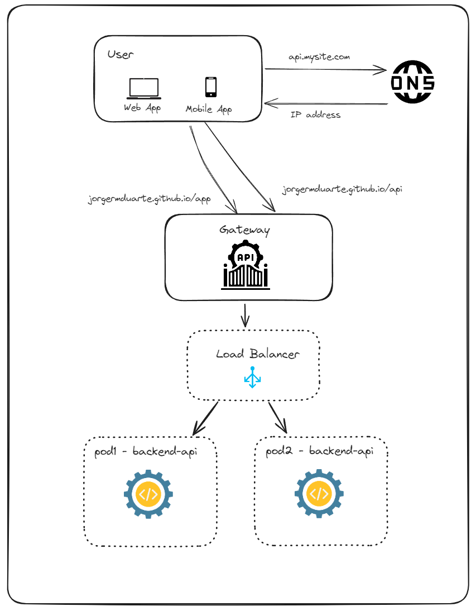

# Project Description

This project showcases a local deployment using **Kubernetes with Minikube** to simulate a microservices-based architecture. The environment is structured to demonstrate how various components, such as API gateways, Kafka clusters, and Flink consumers, can be orchestrated to work together for real-time data processing.

<div style="display: flex; justify-content: space-between;">
  
  
</div>

## Key Components:
1. **API Gateway**: Acts as an entry point for user requests, balancing the load across multiple backend API instances.
2. **Load Balancer**: Distributes traffic evenly across multiple backend API instances to ensure high availability and fault tolerance.
3. **Backend API**: A microservice responsible for handling business logic, producing events to Kafka, and interacting with other services.
4. **Kafka Cluster**: Handles event-driven communication, producing and consuming messages through topics like `mock-user-topic`.
5. **Flink Consumer**: Ingests data from Kafka, performing ETL (Extract, Transform, Load) tasks and pushing the processed data to a **Data Warehouse**.
6. **Data Warehouse (DW)**: Stores processed data, making it accessible for analysis and reporting.
7. **Redis Cache**: Used as an in-memory data store to optimize performance by caching frequently accessed data, reducing load on the backend services and databases.
8. **Monitoring and Logging**: Services such as Prometheus and Grafana are used to track system health, performance metrics, and logs.

## Local Environment:
- **Minikube** is used to run this Kubernetes setup locally for demonstration purposes. Minikube allows all services to run within a single-node cluster, emulating a real-world microservices architecture. The environment is configured with several deployments, including Kafka, Flink, Oracle DB, Redis, Prometheus, and Redis, to mimic a distributed system.

## Future Expansion:
- If this were a production-ready setup, the architecture would scale across multiple **Kubernetes clusters**. The **Master Node** would manage **worker nodes**, ensuring scalability, high availability, and failover capabilities. Using a more distributed architecture would ensure that the platform can handle real-world production loads with increased reliability and flexibility.


## Starting Minikube

```
  minikube start --cpus 5 --memory 9192 --disk-size=50g --driver=docker
  minikube dashboard
```

## Publishing everything to the minikube for the first time
```
  kubectl apply -f .\kubernetes\deployment\zookeper-deployment.yaml
  kubectl apply -f .\kubernetes\deployment\redis-deployment.yaml
  kubectl apply -f .\kubernetes\deployment\kafka-deployment.yaml
  kubectl apply -f .\kubernetes\jobs\kafka-topics-job.yaml  

  # build & deploy the node-backend-api image
  docker build -t node-backend-api:latest ./node-backend-api
  minikube image load node-backend-api:latest
  kubectl apply -f .\kubernetes\deployment\node-backend-api-deployment.yaml

  # build & deploy the data warehouse image
   kubectl apply -f .\kubernetes\deployment\oracle-db-deployment.yaml
  docker build -t data-warehouse-app:latest .\datawarehouse\
  minikube image load data-warehouse-app:latest
  kubectl apply -f .\kubernetes\jobs\data-warehouse-job.yaml

  # build & deploy the flink-consumer image
  docker build -t flink-consumer:latest ./flink-consumer
  minikube image load flink-consumer:latest
  kubectl apply -f .\kubernetes\deployment\flink-consumer-deployment.yaml

  # build & deploy the gateway
  docker build -t gateway-app:latest .\Gateway\Gateway
  minikube image load gateway-app:latest
  kubectl apply -f .\kubernetes\deployment\gateway-deployment.yaml

  # other stuff
  #kubectl apply -f .\prometheus-deployment.yaml
  #kubectl apply -f .\grafana-deployment.yaml
```

## Minikube useful comands
```
  # list pods
  kubectl get pods
  # fowarding one local port to one pod:
  kubectl port-forward <pod-name> 3001:3001
```

## Connecting in PowerBI
User: jorgermduarte
pass: 123456
server: localhost:1521/jorgermduarte