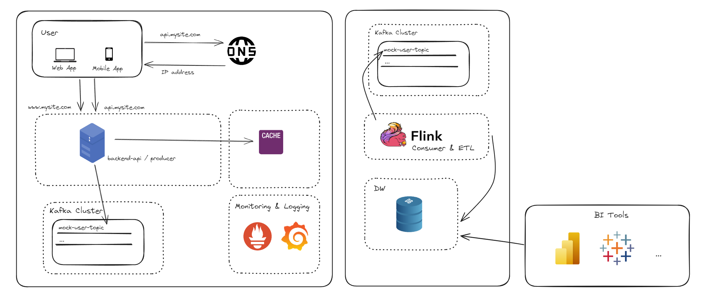

# real-time-data-architecture-kafka-flink-dw-k8s



# Elements
- [x] Redis
  - [x] Eviction Policy LRU
  - [x] Max memory defined (100MB)
- [x] Node backend api
  - [x] Swagger documentation at /api-docs
  - [x] endpoints:
    - [x] [POST] /mock/user
    - [x] [GET]  /mock/user/:userid
    - [x] [GET]  /metrics (for prometheus)
  - [X] Save user data on the "mock-user-topic"
- [x] Kafka + Zookeeper
- [x] CMAK
- [ ] Api Gateway
- [x] Monitoring & Logging
  - [x] Grafana
  - [x] Prometheus
- [x] Flink
  - [x] Read message from kafka
  - [x] Process it and save it on the DW
- [x] DW
  - [x] Configuration
  - [x] Creation of the DW tables
- [x] PowerBI
  - [x] Oracle Support Plugin (64-bit Oracle Client for Microsoft Tools 19c)
    - [x] https://www.oracle.com/database/technologies/appdev/ocmt.html
- [ ] Kubernetes
  - [ ] Minikube (https://minikube.sigs.k8s.io/)


# Starting Minikube

```
  minikube start --cpus 5 --memory 9192 --disk-size=50g --driver=docker
  minikube dashboard
```

# Publishing everything to the minikube for the first time
```
  kubectl apply -f .\kubernetes\deployment\zookeper-deployment.yaml
  kubectl apply -f .\kubernetes\deployment\redis-deployment.yaml
  kubectl apply -f .\kubernetes\deployment\kafka-deployment.yaml
  kubectl apply -f .\kubernetes\jobs\kafka-topics-job.yaml  

  # build the node-backend-api image
  docker build -t node-backend-api:latest ./node-backend-api

  # load it to minikube
  minikube image load node-backend-api:latest

  # apply the deployment for the node backend api
  kubectl apply -f .\kubernetes\deployment\node-backend-api-deployment.yaml

  kubectl apply -f .\kubernetes\deployment\oracle-db-deployment.yaml


  # build the data warehouse image
  docker build -t data-warehouse-app:latest .\datawarehouse\
  minikube image load data-warehouse-app:latest
  kubectl apply -f .\kubernetes\jobs\data-warehouse-job.yaml

  # build the flink-consumer image
  docker build -t flink-consumer:latest ./flink-consumer
  minikube image load flink-consumer:latest
  kubectl apply -f .\kubernetes\deployment\flink-consumer-deployment.yaml

  #kubectl apply -f .\prometheus-deployment.yaml
  #kubectl apply -f .\grafana-deployment.yaml
```

# Minikube useful comands
```
  # list pods
  kubectl get pods
  # fowarding one local port to one pod:
  kubectl port-forward <pod-name> 3001:3001
```

# Connecting in PowerBI
User: jorgermduarte
pass: 123456
server: localhost:1521/jorgermduarte